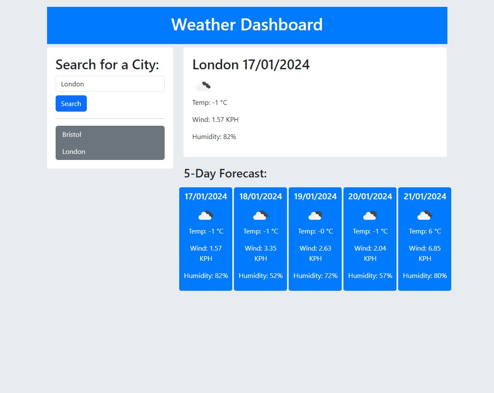

# weather-forecast

# Unit 4 Challenge: Password generator form

## Description

This program is a weather dashboard with form inputs.

### Weather Dashboard Application - README

#### Overview
The Weather Dashboard Application is designed to provide users with current and future weather conditions for their city of interest. This user-friendly app adds efficiency and convenience to your daily weather checks, whether you're planning a trip or just need to be prepared for the day ahead.

#### Features

1. **City Search**:
   - The website uses geolocation on the first visit.
   - Users can search for any city to view its current and future weather conditions.
   - Each searched city is added to the search history for easy access in future sessions.

2. **Current Weather Conditions**:
   - **City Name**: Displays the name of the city for which weather is being checked.
   - **Date**: Shows the current date.
   - **Weather Icon**: An icon representation of the current weather conditions.
   - **Temperature**: Current temperature of the city.
   - **Humidity**: Current humidity levels in the city.
   - **Wind Speed**: Speed of the wind in the city.

3. **Future Weather Conditions**:
   - Users are presented with a 5-day weather forecast for the selected city.
   - Each day's forecast includes:
     - **Date**: The date of the forecast.
     - **Weather Icon**: An icon representation of the expected weather conditions.
     - **Temperature**: Forecasted temperature.
     - **Humidity**: Forecasted humidity levels.

4. **Search History**:
   - Clicking on a city in the search history will present the user with current and future conditions for that city again.

#### How to Use
1. Open the Weather Dashboard Application.
2. Enter the name of the city in the search bar and press enter or click the search button.
3. View current weather conditions and the 5-day forecast for the selected city.
4. Click on any city in the search history to quickly view weather conditions for that city again.

Enjoy easy and quick access to weather forecasts with the Weather Dashboard Application!

The site can be accessed at https://oleksiieng.github.io/weather-forecast/

## Table of Contents

- [Installation](#installation)
- [Credits](#credits)
- [License](#license)

## Installation

To install this project:

1. Clone the repository to your local machine using `git@github.com:Oleksiieng/weather-forecast.git`.
2. Open the project in VS Code or any preferred IDE.
3. Ensure you have a live server extension installed, or use a local server to view the web application.

## Credits

Resources consulted for learning purposes:

- [Mozilla Developer Network (MDN)](https://developer.mozilla.org/)
- [W3Schools](https://www.w3schools.com/)

## License

This site licensed under the [MIT license](https://opensource.org/licenses/MIT).
